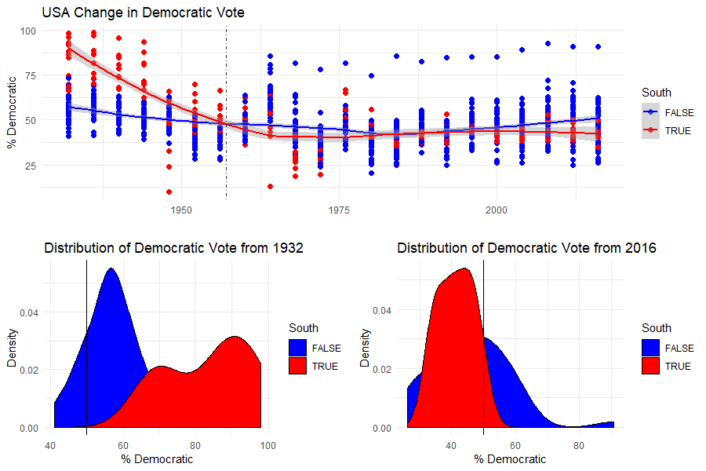

```{r setup, include=FALSE}
# This is a good place to put libraries required for using the ggplot function
knitr::opts_chunk$set(echo = TRUE)
options(scipen=999)
library(tidyverse)    #Loads the tidyverse suite of packages
# install.packages('Lahman')
library(Lahman)       #Contains the baseball data to use
library(nycflights13) #Contains the 2013 NYC flights data
#install.packages("maps")
library(maps)
library(pscl) #Loads the pscl package for the dataset
library(gridExtra) #Allows us to combine ggplots into a nice layout
```

# Lab 3a: Relational Data

## Introduction

The main purpose of this lab is to practice data join skills from Chapter 10. The functions and their purposes are listed as follows:

- `inner_join()` Keeps observations appear in both datasets.

- `left_join()` Keeps all observations in left dataset.

- `right_join()` Keeps all observations in right dataset.

- `full_join()` Keeps all observations in both datasets.

- `semi_join()` Keeps all observations in left dataset that have a match in right dataset.

- `anti_join()1` Drops all observations in left dataset that have a match in right dataset.

You will need to modify the code chunks so that the code works within each of chunk (usually this means modifying anything in ALL CAPS). You will also need to modify the code outside the code chunk. When you get the desired result for each step, change `Eval=F` to `Eval=T` and knit the document to HTML to make sure it works. After you complete the lab, you should submit your HTML file of what you have completed to Sakai before the deadline.

## Part 1

In part 1, you will practice the skills using the datasets from the R package `Lahman`. This database includes data related to baseball teams. It includes summary statistics about how the players performed on offense and defense for several years. It also includes personal information about the players.

The `Batting` data frame contains the offensive statistics for all players for many years. You can see, for example, the top 10 hitters in 2016 by running this code: (For more details of the dataset run `?Batting` in console.)
```{r}
top <- Batting %>% 
  filter(yearID == 2016) %>%
  arrange(desc(HR)) %>%
  slice(1:10)

top #Do Not Remove
```

But who are these players? We see an ID, but not the names. The player names are in this table named `People`.

```{r}
head(People,5)
```

We can see column names `nameFirst` and `nameLast` in table `People`.

### 1.1 (1 Point)

Use the `left_join` function to create a data frame called `top1`, which contains information of the 10 top home run hitters. The table should have the following columns: `playerID`, `nameFirst`, `nameLast`, and number of home runs (`HR`).

```{r, eval=T}
top1 = top %>% 
  left_join(People, by = "playerID") %>% # joins top with People using playerID
  # gets name of the players
  select(playerID, nameFirst, nameLast, HR)

top1 #Do Not Remove
```

### 1.2 (2 Points)

Data `Salaries` contains the baseball player salary data. 

```{r}
head(Salaries,5)
```

You may be curious about the salaries of the top 10 hitters in 2016:

- Now create a new data frame called `top2` by adding top 10 hitters' salaries to `top1` and including only `nameFirst`, `nameLast`, `teamID`, `HR`, and `salary` columns. 
- Rename the columns to `FirstName`, `LastName`, `Team`, `Homeruns` and `Salary` respectively.
- Arrange the data frame by `Salary` in descending order. 

Note that salaries are different every year so make sure to filter for the year 2016. This time, only use `right_join` to complete the exercise.

```{r, eval=T}
top2 = Salaries %>%
  filter(yearID == 2016) %>%
  right_join(top1,by = "playerID") %>%
  select(FirstName = nameFirst,
         LastName = nameLast,
         Team = teamID,
         Homeruns = HR,
         Salary = salary) %>%
  arrange(desc(Salary))

top2   #Do Not Remove
```

## Part 2

In this part, we will explore relational data from `nycflights13`, which contains four data frames related to the `flights` table that you used in previous assignments.

### 2.1 (2 Points)

Data `airports` gives information about each airport, such as latitude and longitude, identified by the `faa` airport code.
```{r}
head(airports,5)
```

Based on `flights`, compute the average arrival delay by destination (`dest`) and ignore missing values, then join on the `airports` data frame. Only use an inner join.

```{r, eval=T}
delay = flights %>%
  group_by(dest) %>%
  summarise(avg_arr_delay = mean(arr_delay, na.rm = TRUE), # calculates mean arr_delay per dest, ignore NA
            .groups='drop') %>% # drops grouping after summarizing 
  inner_join(airports,by= c("dest" = "faa")) %>% # join w/ airports dataset
  # where dest is faa code
  select(dest, name, lat, lon, avg_arr_delay)
delay #Do Not Remove
```

### 2.2 (1 Points)

Draw a scatterplot with dots representing destination locations and colors of dots representing average arrival delay on US map. We do this to look at the spatial distribution of average arrival delay.
```{r, eval=T}
delay %>%
  ggplot(aes(x = lon, y = lat, color = avg_arr_delay)) +
    borders("state") + # add outline of US states to plot background
    geom_point() + # plot each airport as point
    coord_quickmap() # aspect ratio not distorted upon plotting
```

### 2.3 (1 Points)
Data `planes` gives information about each plane, identified by its `tailnum`. Note that `year` column in `planes` represents the year a plane was manufactured, which is different from `year` column in `flights`.

```{r}
head(planes,5)
```

Use the `planes` data to calculate the `age` of planes, assuming current year is 2013. Keep only `tailnum` and `age` in the output table `plane_ages`. 

```{r, eval=T}
plane_ages <- 
  planes %>%
  mutate(age = 2023 - year) %>%
  select(tailnum, age)
plane_ages #Do Not Change
```

### 2.4 (2 Points)

Is there a relationship between the age of a plane and its delays? 

- Join the `plane_ages` with `flights`, keeping observations with matches in both datasets.
- Summarize the average departure delay by plane `age` and ignore missing values.
- Draw a scatterplot of plane age vs. average departure delay.

```{r, eval=T}
flights %>%
  inner_join(plane_ages, by = "tailnum") %>% # keep flights where plane age info 
  group_by(age) %>% # groups by plane age
  summarise(avg_dep_delay = mean(dep_delay, na.rm = TRUE), # calculates mean departure delay, ignore NA
            .groups='drop') %>% # drop grouping
  ggplot(aes(x = age, y = avg_dep_delay)) +
  geom_point()
```


### 2.5 (0.5 Points)

What does it mean for a flight to have a missing `tailnum`? 
```{r, eval=T}
flights %>%
  filter(is.na(tailnum))
```
Answer: For a flight to have a missing "tailnum", there is also no record for air_time, arr_delay, dep_delay, arr_time, dep_time, and dep_delay. This probably means the flights were canceled. 

### 2.6 (0.5 Points)

What do the tail numbers that don’t have a matching record in planes have in common? (Hint: one variable explains ~90% of the problems. Check the documentation of `planes` for help.) 

```{r, eval=T}
flights %>% 
  anti_join(planes, by = "tailnum") %>%
  count(is.na(tailnum)) %>% # we can count how many flights w/ no match
  arrange(desc(n)) # find flights w missing tailnums
```

Answer: Tail numbers that do not have a matching record in the planes dataset are unregistered plans or are missing in the data. A large portion have missing vals for tailnum, so the absence is probably due to incomplete tailnum data in the dataset.


# Lab 3b: Building a Graphic

## Introduction

In this lab, we will slowly construct the image below via `ggplot`. This chart was created using the `presidentialElections` dataset in the `pscl` package. These plots visually compare the historical change in the Democratic Vote between the former Confederate states and non-Confederate states.



You will need to modify the code chunks so that the code works within each of chunk. When you get the desired result for each step, change `eval=F` to `eval=T` and knit the document to HTML to make sure it works. Do not work out of order or skip around. After you complete the lab or by the end of class, you should submit your HTML file of what you have completed to Sakai.

For ease, we start by reassigning the dataset `presidentialElections` to a new variable called `PE`.

```{r}
PE=presidentialElections
```


## Part 1: Time Series Plot

### 1.1: Initiate Plot and Print (0 Points)
```{r,eval=T}
p1<-ggplot(data=PE) +
  geom_point(aes(x=year,y=demVote,color=as.factor(south)),size=2)
p1
```

### 1.2: Modify the Title and Labels (0 Points)

Use `xlab()`, `ylab()`, and `ggtitle()`.
```{r,eval=T}
p2<-p1+xlab("")+ylab("% Democratic")+ggtitle("USA Change in Democratic Vote")
p2
```

### 1.3: Get Smooth Curves and Print (1 Point)

Use `geom_smooth` similarly how we used `geom_point`.
```{r,eval=T}
p3 <- p2 + 
  geom_smooth(aes(x = year, y = demVote, color = as.factor(south)))
              
p3
```

### 1.4: Modify the Legend Title and Print (0.5 Points)

Since the legend is for the color aesthetic we use `guides(color=guide_legend(title=COMPLETE_INSIDE))` to rename the legend.
```{r,eval=T}
p4<-p3 +
  guides(color = guide_legend(title = "Former Confederate?"))
p4
```


### 1.5: Manually Select the Colors and Print (1 Point)

For the color aesthetic, we want to manually select the two different colors.
```{r,eval=T}
p5<-p4+ scale_color_manual(values=c("skyblue","maroon"))
p5
```


### 1.6: Reference Line and Print (1 Point)

It doesn't seem to be until around 1957 where the non-Confederate states began to exceed the former Confederacy on approval for the Democratic party. We want to create a vertical line through the x-axis at 1957  using `geom_vline`. Check `?geom_vline` for more information about this geometric object.

For the color aesthetic, we want to manually select the two different colors.
```{r,eval=T}
p6<-p5 + 
  geom_vline(xintercept = 1957, alpha=0.8, linetype=4)
p6
```

### 1.7: Modify the Theme and Print (0.5 Points)

Use `theme_minimal()` for the plot.
```{r,eval=T}
FINALPLOT1<- p6 + 
  theme_minimal()
FINALPLOT1
```


## Part 2: Overlapping Density Curves in 1932 and 2016

### 2.1: Create Basic Density Plot (0 Points)

`PE$year` is a vector of all the years represented in the data for all states. `PE$year==1932`creates a vector of `TRUE` and `FALSE` where `TRUE` indicates observations from the year 1932. `PE[PE$year==1932,]` modifies the dataset to only include the data for the year 1932.

```{r,eval=T}
p1<-ggplot(data=PE[PE$year==1932,]) +
      geom_density(aes(x=demVote,fill=south))
p1
```

### 2.2: Modify Plot and Print (2 Points)

Modify the legend, titles, color, theme similarly to how we did the first plot. Also, add a vertical line at 50 which indicates the transition to a majority vote.

```{r,eval=T}
FINALPLOT2<- p1 + 
  xlab("% Democratic Votes") + 
  ylab("Density") +
  ggtitle("Dist. of Dem Vote Share From 1932") +
  scale_fill_manual(values = c("blue", "red"), name = "Former Confederate?") + 
  geom_vline(xintercept = 50, color = "black", linetype = "dashed", alpha = 0.8) + 
  theme_minimal()
FINALPLOT2
```

### 2.3: Overlapping Density Curves in 2016 (2 Points)

Repeat the code that created **FINALPLOT2** for the year 2016. I advise copy and paste. 

```{r,eval=T}
FINALPLOT3 <- ggplot(PE[PE$year == 2016, ]) +
  geom_density(aes(x = demVote, fill = south), alpha = 0.6) + 
  xlab("% Democratic Votes") + 
  ylab("Density") +
  ggtitle("Dist. of Dem Vote Share From 2016") +
  scale_fill_manual(values = c("blue", "red"), name = "Former Confederate?") + 
  geom_vline(xintercept = 50, color = "black", linetype = "dashed", alpha = 0.8) + 
  theme_minimal()
FINALPLOT3
```


## Part 3: Arrange All Plots in a Pleasant Layout

### 3.1: Arrange Images Into Grid (2 Points)

The `grid.arrange()` function from the `gridExtra` package allows us to do this. This needs to be done after all three plots are created. See if you can figure out what is going on. After knitting the document and observing the picture, change the code chunk option `fig.width=4` to `fig.width=8` and see what happens.

```{r layout, eval=T, fig.width=4}
#First Examine this Code and See What Happens

#Defaults to 1 Column Layout and Stacks Plots
grid.arrange(FINALPLOT1,FINALPLOT2,FINALPLOT3) 

#Starts Placing Plots in a Two Column Layout
grid.arrange(FINALPLOT1,FINALPLOT2,FINALPLOT3,ncol=2) 

#Now Check this Code Out: Try to Understand how the Matrix is Created and How the Layout is Controlled by the Matrix. Modify It to Get What I created
matrix(c(1,1,2,3),ncol=2)
layout_matrix = matrix(c(1,1,2,3),ncol=2)
grid.arrange(FINALPLOT1,FINALPLOT2,FINALPLOT3,layout_matrix= layout_matrix)
```

